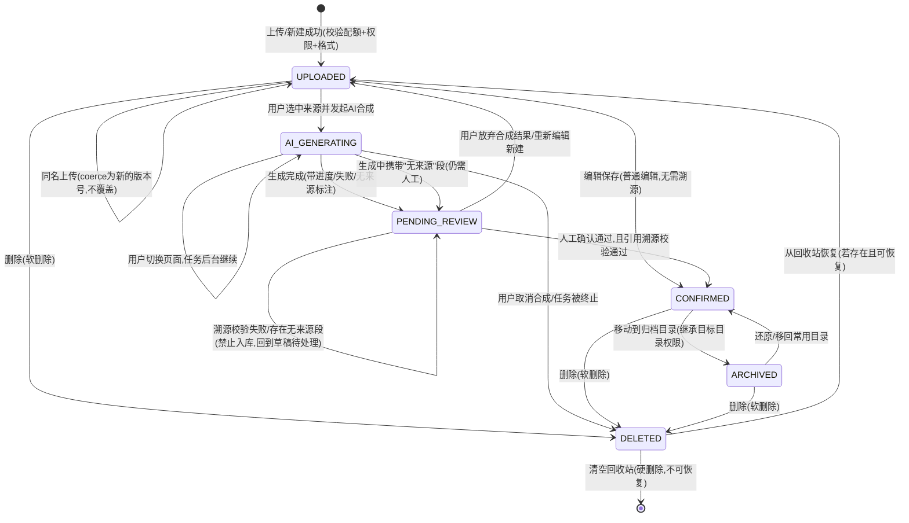

# DocHub —— 产品需求规格说明书（PRD）

> 文档版本：v1.0
> 依附文档：docs/01-requirements/USER_STORIES.md、docs/01-requirements/用户旅程与原子故事分解.md
> 编写视角：系统架构与全局工程视角（系统架构师 + 资深 SaaS PM）
> 产品定位：面向中小企业的“管理 + 智能”双引擎智能文档管理平台

---

## 目录

1. 系统概述与 MVP 业务边界
2. 角色与 RBAC 权限矩阵
3. 文档全生命周期状态机
4. 功能模块详细规格与业务规则字典
5. 非功能性需求（NFR）
6. 显式非目标清单（Out of Scope / Won't Have）

---

## 1. 系统概述与 MVP 业务边界

### 1.1 系统定位

DocHub 通过 **“管理层 + 智能层”双引擎**构建企业文档的**安全存储、协作流转与智能增值**闭环：

- **管理层**：以”部门空间 + 角色权限（查看者/编辑者/管理员）“为骨架，提供文档的安全存储、版本管理与协作流转。
- **智能层**：围绕 **“查看 → 检索 → 合成”** 三步闭环，提供语义检索，并基于已有文档自动合成**带引用溯源的新文档**（周报汇总、方案初稿、制度摘要等）。

### 1.2 双引擎闭环

```
┌──────────────────────────  管理层（管理引擎）  ──────────────────────────┐
│  部门空间 ── 角色权限(查看/编辑/管理) ── 文档存储 ── 版本管理 ── 归档治理 │
└─────────────────────────────── ▲ ────────────────────────────────────┘
                                  │ 供档（引用来源）
┌─────────────────────────────── │ ────────────────────────────────────┐
│  查看 ──▶ 语义检索 ──▶ AI 合成 ──▶ (引用溯源校验 + 人工确认) ──▶ 入库归档 │
└──────────────────────────  智能层(智能引擎)  ─────────────────────────────┘
```

### 1.3 MVP 业务边界

MVP 版本只交付解决核心痛点的最小可用闭环，**边界原则**：

- **必须打通**：「上传/查看 → 检索 → AI 合成 → 人工确认 → 归档入库」全链路；
- **必须保留的底线**：
  1. AI 合成结果**每个关键观点可溯源**到源文档；
  2. AI 合成结果**未经“引用溯源校验 + 人工确认”不得进入已入库（CONFIRMED）状态**；
  3. 所有读写/检索/下载/合成动作在**服务端二次鉴权**（严禁仅前端控制）。
- **明确不做**：全文搜索引擎、在线多人实时协同编辑、文档审批流、跨组织外部分享（详见第 6 章）。

### 1.4 目标用户（三种角色）

| 角色 | 定义 | 核心关切 |
| --- | --- | --- |
| 普通员工 | 日常文档的生产者与使用者 | 高效上传/查看/检索/合成/归档 |
| 部门文档管理员 | 部门空间治理者 | 权限分配、空间管理、文档治理 |
| 超级管理员（IT/行政） | 系统级负责人 | 系统配置、存储配额、安全审计 |

---

## 2. 角色与 RBAC 权限矩阵

权限模型基于 **部门空间 × 文件操作 × AI 合成与入库** 三个维度，粒度精确到三种角色。

> 说明：本文角色即 **Viewer / Editor / Admin 三档**（对应中文：查看者/编辑者/管理员）。部门文档管理员 = 部门空间的 Admin；超级管理员拥有跨空间系统级权限。

### 2.1 维度一：部门空间（空间级能力）

| 能力项 | Viewer | Editor | Admin（部门/系统） |
| --- | :---: | :---: | :---: |
| 进入 / 浏览所属部门空间 | ✅ | ✅ | ✅ |
| 查看空间元数据（配额、成员数） | ✅ | ✅ | ✅ |
| 在空间内查看文档 | ✅ | ✅ | ✅ |
| 在空间内上传 / 新建文档 | ❌ | ✅ | ✅ |
| 编辑已被授予编辑权的内容 | ❌ | ✅ | ✅ |
| 删除文档（移入回收站） | ❌ | ✅* | ✅* |
| 管理空间配置（配额、命名、目录） | ❌ | ❌ | ✅ |
| 管理成员角色分配 | ❌ | ❌ | ✅ |
| 查看空间审计 / 访问记录 | ❌ | ❌ | ✅ |

> \*：删除权限为“可删除自己可写的内容”；空间级删除关闭仅 Admin。开启回收站保护后，删除为软删除，见状态机。

### 2.2 维度二：文件操作（单文件级能力）

| 能力项 | Viewer | Editor | Admin |
| --- | :---: | :---: | :---: |
| 在线预览 | ✅ | ✅ | ✅ |
| 下载原始文件 | ❌ | ✅ | ✅ |
| 上传（同名触发版本冲突→新版本） | ❌ | ✅ | ✅ |
| 查看历史版本 | ✅ | ✅ | ✅ |
| 还原历史版本 | ❌ | ✅ | ✅ |
| 移动 / 归类文档 | ❌ | ✅ | ✅ |
| 将文档标记收藏 | ✅ | ✅ | ✅ |
| 硬删除文档（清空回收站） | ❌ | ❌ | ✅ |
| 重命名文档 | ❌ | ✅ | ✅ |

### 2.3 维度三：AI 合成与入库（智能层能力）

| 能力项 | Viewer | Editor | Admin |
| --- | :---: | :---: | :---: |
| 使用语义检索（范围=有权访问的文档） | ✅ | ✅ | ✅ |
| 查看检索结果引用来源 | ✅ | ✅ | ✅ |
| 发起 AI 合成 | ✅ | ✅ | ✅ |
| 查看合成进度与失败原因 | ✅ | ✅ | ✅ |
| 编辑合成结果草稿 | ✅ | ✅ | ✅ |
| 执行引用溯源校验（服务端强制，非用户操作） | —服务端强制执行，与角色无关— |
| 人工确认并入库归档（确认后才能进 CONFIRMED） | ✅ | ✅ | ✅ |
| 将合成结果写入无权限目录 | ❌ | ❌ | ❌（服务端拦截） |

**三维权限判定红线**
- 任一操作落库前都执行 **“当前用户 ← 部门空间权限 × 文件操作 × AI 合成与入库”** 三方与服务端校验；
- 下载、移动、删除、入库等敏感操作**必须返回可测试的状态码**（见 PRD §5 与 BDD 清单）。

---

## 3. 文档全生命周期状态机

> 状态机遵循 [USER_STORIES.md](file:///d:/WorkSpace/Java/WenDang/docs/01-requirements/USER_STORIES.md) 中 US-EMP-05~09 对应约束。关键硬约束：**AI 合成结果必须经“引用溯源校验 + 人工确认”两道门槛方可进入 CONFIRMED 态；未经确认或校验失败禁止自动落库。**



### 状态定义与流转触发条件

| 状态 | 定义 | 进入前置条件 | 允许的流出 |
| --- | --- | --- | --- |
| **UPLOADED** | 已上传 / 新建的正式文档 | 配额未超限、格式合法、入档权限校验通过 | → AI_GENERATING / CONFIRMED / DELETED |
| **AI_GENERATING** | AI 合成任务执行中 | 已选中 ≥1 篇有权限的来源文档、合成类型合法 | → PENDING_REVIEW / DELETED |
| **PENDING_REVIEW** | 合成结果草稿，等待溯源校验与人工确认 | 生成完成（可含“无来源”标记段） | → CONFIRMED（双门槛通过）/ UPLOADED / 停留待处理 |
| **CONFIRMED** | 已入库的正式文档 | **引用溯源校验通过 且 用户显式人工确认** | → ARCHIVED / DELETED / UPLOADED |
| **ARCHIVED** | 归档文档 | 已确认文档移动到归档目录，权限继承目标目录 | → DELETED / CONFIRMED（还原） |
| **DELETED** | 回收站中的软删除文档 | 任一可删除状态下执行删除 | → UPLOADED（恢复）/ [*]（硬删除） |

> 注：`PENDING_REVIEW → CONFIRMED` 有且仅有两条 Gate：(1) 引用溯源校验全部通过；(2) 用户显式点击“确认入库”。两条同时满足才放行，否则停留 PENDING_REVIEW（见 §4.5 业务规则）。

---

## 4. 功能模块详细规格与业务规则字典

### 4.1 功能模块清单

| 模块 | 关联故事 | 交付内容 |
| --- | --- | --- |
| M1 部门空间 | US-DMA-01/02/03 | 空间创建、配置、成员管理与角色分配 |
| M2 文档存储与版本 | US-EMP-01/02/10 | 上传、预览、下载、版本管理与还原 |
| M3 语义检索 | US-EMP-03/04 | 自然语言检索、引用来源展示 |
| M4 AI 合成 | US-EMP-05/06/07 | 合成任务、进度、来源标注、草稿编辑 |
| M5 入库与归档 | US-EMP-08/09 | 溯源校验、人工确认、归档入库、权限继承 |
| M6 文档治理 | US-DMA-04/05/06 | 移动/归类/重命名、权限回收、访问记录 |
| M7 系统管理 | US-SUP-01~06 | 初始化、配额、审计、告警、日志导出 |

### 4.2 权限继承规则（RBAC Inheritance）

1. **来源继承**：归档 / 移动后的文档，其访问权限默认继承**目标目录 / 目标空间**的层级权限；如用户对目标目录无相应权限，则该移动 / 归档操作被服务端拒绝（HTTP 403）。
2. **角色越权不可自授**：Editor 不可将自己的权限提升为 Admin，更不可提升他人为 Admin。
3. **降级即时生效**：角色降级（Editor→Viewer）后，其写 / 删除 / 下载权限**即时失效**，后续操作返回 HTTP 403。
4. **管理员保留底线**：任何空间必须保留 ≥1 名 Admin；回收最后一名 Admin 的操作被拒绝并提示。
5. **重授权非恢复**：被回收权限后重新仅授予 Viewer，仅获得读权限，不因历史曾为 Editor 而恢复写权限。
6. **检索范围的权限裁剪**：语义检索结果服务端强制裁剪到“当前用户有权限访问的文档集合”，越权文档不进结果、不泄露存在性。

### 4.3 版本冲突处理规则（Version Conflict）

1. **同名不覆盖**：同一目录上传同名文件，不覆盖已有文件；而是**生成新的递增版本号**（v1→v2→…）。
2. **历史版本保留**：每一次上传（含同名与编辑保存）都保留历史版本与 {版本号、修改人、修改时间} 元数据。
3. **版本还原**：Editor/Admin 可将当前文档还原到任意历史版本；查看者仅可预览历史版本，不可还原。
4. **迁移 / 移动冲突**：移动文档时若目标目录存在同名文档，触发同名冲突确认，**未确认前不覆盖目标文件**。
5. **版本缺失容错**：被清除或损坏的版本展示“该版本不可用”，不影响其他版本正常访问。

### 4.4 配额计算规则（Quota Calculation）

1. **计算粒度**：配额按 `部门空间` 维度统计，全局另有总配额约束。
2. **配额判定时机**：上传 / 新建入口即时校验（已用 + 本次文件大小 ≤ 配额），超限即拒绝上传并返回明确提示。
3. **历史文件不受影响**：下调配额不会删除或截断已有文档；仅当新的上传请求超出剩余配额时拦截。
4. **告警分级**：用量 ≥ 阈值（如 80%）触发告警；同级告警同一状态不重复生成；超限上传含配额不足提示。
5. **一致性约束**：部门配额之和 ≤ 全局上限；违反时拒绝提交或要求二次确认。

### 4.5 合成引用溯源规则（Citation Provenance）

1. **每次合成任务必须登记**：创建任务时校验来源集合，全部源文档需在当前用户可访问范围内且至少选中 1 篇；无来源或来源全失效则终止任务，不创建任务记录。
2. **引用溯源校验为强制门槛**：`PENDING_REVIEW → CONFIRMED` 时，服务端对合成结果逐观点执行溯源校验，确保每个观点有真实、可访问、用户有权读的源文档支撑。
3. **无来源内容需标记**：AI 无法映射到源文档的段落被标记为“无引用来源/需人工核实”；此类内容**不可被静默跳过**。
4. **确认后二次校验 + 回滚**：最终入库前再次执行溯源校验；若源文档在确认后被删除致校验失败，**入库原子性终止**，文档保持 PENDING_REVIEW，不产生部分落库数据。
5. **来源失效提示**：点击溯源标注时若源文档不存在或越权，提示“来源文档已失效”，该来源标记为不可验证。

---

## 5. 非功能性需求（NFR）

### 5.1 安全性（Security）

- **传输加密**：全链路 HTTPS / TLS 1.2+；一切 API 与文件流走加密通道。
- **存储加密**：文档内容静态加密存储；敏感字段（如审计详情）加密。
- **越权访问拦截**：所有读/写/检索/下载/合成/入库动作在**服务端二次鉴权**；越权统一返回 `HTTP 403`，不泄露受限元数据。
- **水印与下载管控**：Viewer 可在预览时叠加不可见 / 可见水印（用户标识）；下载仅 Editor/Admin 可用，且动作进入审计。
- **操作审计日志**：登录、访问、上传、编辑、版本还原、删除、回收、AI 合成入库等动作全部留痕，字段含{主体、动作、对象、时间、结果}。

### 5.2 媒体资源（Media）

- **单文件上限**：单文件 ≤ 100MB。
- **分片上传**：大文件支持分片上传与断点续传，分片可校验完整性。
- **预览格式转码**：支持的预览格式（PDF / 主流 Office / 图片 / 文本）由服务端**转码为统一预览格式**；不支持的格式返回“暂不支持在线预览”并可降级为下载。

### 5.3 性能规范（Performance）

- **首屏 LCP**：4G 网络下 Web 端首屏加载 LCP ≤ 1.5s。
- **检索响应**：语义检索接口响应 ≤ 2s（P95）。
- **分页规范**：列表与日志等查询使用 **Keyset / Cursor 游标分页**，避免深分页性能退化；返回可判定的分页游标。
- **合成异步**：AI 合成采用异步任务，不阻塞请求；前端展示进度，支持失败重试。
- **审计日志**：百万级日志下按时间范围查询可正确分页返回，不越权、不重复。

### 5.4 可靠性与可测性（附加）

- 关键边界（权限、配额、版本、溯源）均可被自动化测试断言（复用 BDD 场景与 `HTTP 403/400/422` 约定）。
- 处置 / 回收 / 收藏等操作满足**幂等性**。

---

## 6. 显式非目标清单（Out of Scope / Won't Have）

遵循 MVP 极简闭环原则，以下能力**本版本明确不交付 / 不承担**，避免过度设计与复杂度失控：

| # | 非目标项 | 说明 | 原因 |
| --- | --- | --- | --- |
| 1 | **全文搜索引擎**（自建索引 / Elasticsearch 等） | 不引入独立全文检索基础设施 | MVP 以语义检索覆盖核心场景，降低运维成本 |
| 2 | **在线多人实时协同编辑**（OT / CRDT，类 Google Docs） | 不提供多人同文档实时并发编辑 | MVP 为单用户编辑 + 版本管理，降低实现复杂度 |
| 3 | **文档审批流** | 不实现多级审批 / 状态机挂审批节点 | 超出 MVP 闭环，简化为“人工确认入库” |
| 4 | **跨组织外部分享** | 不提供对外 / 跨租户文档分享能力 | 聚焦企业内部闭环，避免权限外泄风险 |
| 5 | 高级检索（组合筛选 / 检索历史） | 预留迭代 | 后续增强 |
| 6 | 智能分类 / 自动标签打标 | 预留迭代 | 后续增强 |

**边界守护规则**
- 提交的 PR 若引入上述能力，视为**超出 MVP 范围**，需重新排期评估。
- 现有“人工确认 + 溯源校验 + 权限继承”等 MVP 底线能力**不得裁剪**。